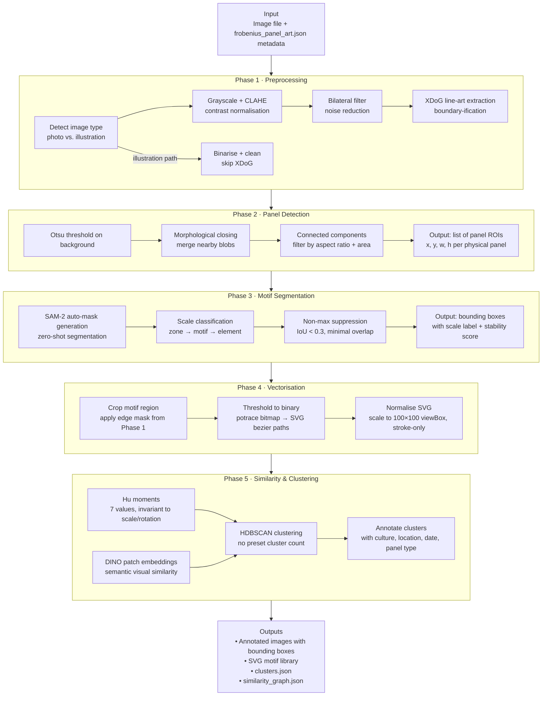

# Frobenius Panel Art — Symbolic Motif Analysis Pipeline

**Date:** 2026-04-15
**Branch:** `claude/panel-art-dataset-XCZOw`
**Todo:** `todos/2026-04-15-frobenius-motif-analysis.md`

Analysis of ancient Yoruba carved door panels from the Leo Frobenius archive.
Goal: identify, extract, vectorize, and cluster individual symbolic motifs from archival photographs and hand-drawn illustrations.

---

## Source Data

- **73 images** in `frobenius_artifacts/images/` — mix of photographs and pen-and-ink drawings
- **Metadata** in `src/typescript/backend/lib/data/frobenius_panel_art.json` (108 records)
- Categories: `door_panel` (21), `ifa_board` (39), `figurine` (14), `motif_illustration` (46)
- Image types:
  - **FoA_\*** — black & white photographs (grainy, aged, sometimes 2–3 panels per frame)
  - **EBA-B_\*** — hand-drawn pen-and-ink or watercolour illustrations (already line-art style)

---

## Technology Decision: Python over JavaScript

JavaScript lacks the libraries required for this pipeline at the level of quality needed:

| Requirement | Python | JS |
|---|---|---|
| Edge / line-art extraction | OpenCV, scikit-image, XDoG | limited (jimp/sharp) |
| Segmentation (SAM-2) | ✅ native | ❌ none |
| Vectorization (potrace) | ✅ pypotrace | ❌ none |
| DINO features | ✅ already in codebase | ❌ none |
| Shape descriptors (Hu moments) | ✅ OpenCV | ❌ none |
| Clustering (HDBSCAN) | ✅ sklearn / hdbscan | minimal |

**Stack:** Python 3.12+, UV, `src/python/panel_art/` package.

---

## Architecture Overview



---

## Phase Details

### Phase 1 · Preprocessing — "Boundary-ification"

**Goal:** convert aged photographs to clean line art resembling the hand-drawn illustrations.

**Algorithm: XDoG (Extended Difference of Gaussians)**

XDoG is parameterised DoG designed to produce illustration-quality closed-contour strokes rather than noisy Canny edges:

```
XDoG(x) = G(x, σ₁) − ε · G(x, σ₂)
result = φ(XDoG(x), τ)   # soft threshold
```

- `σ₁` (fine) ≈ 0.5 — captures carved relief edges
- `σ₂` (coarse) ≈ 1.0–3.0
- `ε` ≈ 0.98 — controls how much coarse structure is subtracted
- `τ` threshold — controls line density

**Why XDoG over Canny:** Canny produces disconnected edge fragments. XDoG produces coherent closed contours, visually matching the pen-and-ink illustration style already present in the EBA-B drawings.

**Image type detection** (photo vs illustration): compare standard deviation of Laplacian — illustrations have very sharp edges and low background noise; photos have higher mid-frequency texture.

Code: `src/python/panel_art/preprocess.py`

---

### Phase 2 · Panel Detection

**Goal:** split multi-panel images (e.g., 3 door panels in one frame) into individual ROI crops.

**Why traditional CV:** the background in Frobenius archive photos is always a plain studio grey/white — reliable for threshold-based separation without a neural detector.

**Steps:**
1. Otsu's threshold on inverted grayscale → binary mask of objects vs background
2. Morphological closing (kernel ≈ 15px) → fills holes within panels
3. `cv2.connectedComponentsWithStats` → bounding rectangles
4. Filter: aspect ratio 0.1–0.8 (panels are tall), area > 5% of image

Code: `src/python/panel_art/panel_detect.py`

---

### Phase 3 · Motif Segmentation (Multi-scale)

**Goal:** detect individual motifs at three scales — zone, motif, element.

**Why SAM-2:** carved wood panels have no colour contrast between motif and background (all same wood tone). SAM-2 uses edge and texture cues without needing domain-specific training. Zero-shot performance is strong on structured visual patterns.

**SAM-2 model choice:**
- `sam2-hiera-tiny` (~40MB) — fastest, adequate for high-contrast carved panels
- HuggingFace Inference API — fallback when running without local GPU

**Scale classification after SAM:**
- zone: mask area > 20% of panel ROI
- motif: 1%–20%
- element: 0.1%–1%

**Non-max suppression:** IoU < 0.3 between retained boxes to ensure minimal overlap as specified.

Code: `src/python/panel_art/motif_segment.py`

---

### Phase 4 · Vectorisation

**Goal:** compact, normalised SVG path representation of each motif for shape comparison.

**Pipeline:**
1. Crop motif region from Phase 1 edge image
2. Threshold to binary (Otsu)
3. `pypotrace` → trace to SVG bezier curves (wraps system `potrace` binary — `brew install potrace`)
4. Parse SVG paths → normalise to 100×100 viewBox, stroke-only, no fill

**Why potrace over manual contour→bezier:** potrace handles corner detection, curve fitting, and path simplification optimally. It produces compact, smooth paths — essential for shape comparison.

Code: `src/python/panel_art/vectorize.py`

---

### Phase 5 · Similarity & Clustering

**Two complementary descriptors:**

| Descriptor | Properties | Use |
|---|---|---|
| Hu Moments (7 values) | invariant to translation, scale, rotation | fast overall shape class |
| DINO patch embeddings | semantic visual similarity | nuanced similarity |

**Clustering:** HDBSCAN — density-based, no preset cluster count, handles noise points. Natural motif families emerge without specifying how many there are.

**Output per cluster:**
- Representative SVG motif
- Member images with metadata (culture, location, date, expedition, panel type)
- Hu moment centroid for the cluster

Code: `src/python/panel_art/similarity.py`

---

## Project Structure

```
src/python/
├── pyproject.toml                  # UV project — defines [project.scripts]
├── panel_art/
│   ├── __init__.py
│   ├── preprocess.py               # Phase 1: XDoG line-art extraction
│   ├── panel_detect.py             # Phase 2: multi-panel ROI splitting
│   ├── motif_segment.py            # Phase 3: SAM-2 auto-mask + NMS
│   ├── vectorize.py                # Phase 4: motif region → SVG
│   ├── similarity.py               # Phase 5: embeddings + HDBSCAN
│   └── pipeline.py                 # End-to-end CLI orchestration
└── scripts/
    └── analyze_panels.py           # Thin wrapper: loads metadata, calls pipeline

frobenius_artifacts/analysis/       # Generated outputs (gitignored)
├── line_art/                       # Phase 1 PNGs
├── panels/                         # Phase 2 ROI crops
├── annotated/                      # Phase 3 annotated images with bounding boxes
├── motifs/                         # Phase 4 SVG files, one per motif
└── clusters/
    ├── clusters.json               # Motif → cluster assignments + metadata
    └── similarity_graph.json       # Pairwise distances
```

---

## Open Questions

| # | Question | Resolution |
|---|---|---|
| OQ-1 | SAM-2 model size — local GPU vs cloud | **Use `sam2-hiera-tiny` locally; HuggingFace Inference API as fallback** |
| OQ-2 | potrace system dependency | **`brew install potrace`** (done) |
| OQ-3 | motif_illustration images already line art — skip Phase 1? | Image type detection in Phase 1 handles this: illustrations go through binarise+clean path, skip XDoG |
| OQ-4 | Non-axis-aligned panels in multi-panel photos | Phase 2 uses minAreaRect (rotated bounding boxes) not just axis-aligned — handles angled panels |

---

## Validation Strategy

Each phase produces an inspectable output before the next phase begins.
Validation checkpoints and results are tracked in `todos/2026-04-15-frobenius-motif-analysis.md`.
